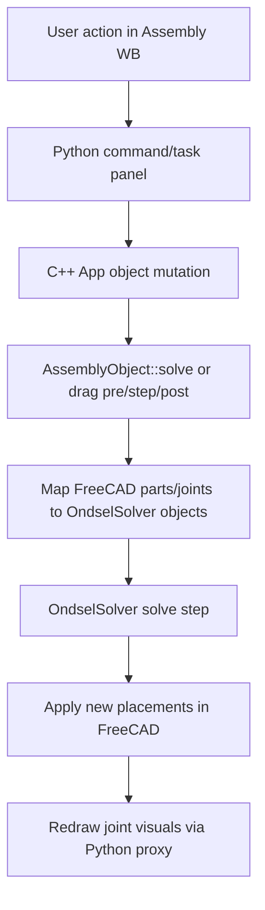
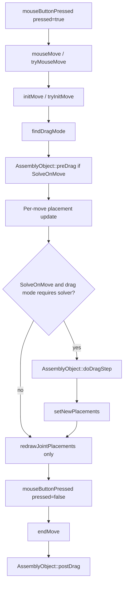

# FreeCAD Assembly Workbench Deep Documentation (Including OndselSolver Integration)

This document is a source-grounded deep dive of `src/Mod/Assembly`, with a recursive file inventory and a focused explanation of the drag-to-solver pipeline.

---

## 1) Scope and repository reality check

- Assembly workbench code lives in: `src/Mod/Assembly`
- Solver integration is done against `OndselSolver/*` headers from C++.
- In this checkout, `src/3rdParty/OndselSolver` is a **git submodule pointer** (tracked entry) and does not contain the solver sources inline.
  - Tracked submodule path: `src/3rdParty/OndselSolver`
  - Submodule commit recorded by this repo: `30e9b64e8bf881d438d4b88834f9ba3674865418`
- Build behavior from `src/Mod/Assembly/CMakeLists.txt`:
  - If `FREECAD_USE_EXTERNAL_ONDSELSOLVER=OFF`: include from `src/3rdParty/OndselSolver`
  - If `FREECAD_USE_EXTERNAL_ONDSELSOLVER=ON`: require system headers (`OndselSolver/enum.h`)

So the assembly side of the integration is fully documented here, while the solver internals are documented as integration contracts/APIs used from FreeCAD.

---

## 2) End-to-end architecture

## 2.1 Layers

- **App layer (`src/Mod/Assembly/App`)**
  - Core model object: `Assembly::AssemblyObject`
  - Solver mapping and execution (`solve`, `preDrag`, `doDragStep`, `postDrag`)
  - Assembly graph traversal, grounded-part handling, and joint typing

- **Gui layer (`src/Mod/Assembly/Gui`)**
  - Interactive drag and edit behavior in `AssemblyGui::ViewProviderAssembly`
  - Command registration and view providers for groups/BOM/links

- **Python layer (`src/Mod/Assembly/*.py`)**
  - Workbench commands and task panels
  - `JointObject.py` defines joint FeaturePython objects and view providers
  - Utility layer (`UtilsAssembly.py`) for selection/reference/geometry helpers

## 2.2 High-level control flow

---

## 3) Dragging a component in a constrained assembly

## 3.1 Exact call sequence in GUI/App

## 3.2 How drag mode is selected (`ViewProviderAssembly::findDragMode`)

Primary outcomes:
- Fixed upstream chain -> walk to upstream movable part
- Revolute -> rotation-on-plane
- Slider -> translation-on-axis
- Cylindrical -> translation-on-axis + rotation
- Ball -> ball mode
- Some distance configurations -> translation-on-plane
- No grounded anchor path -> translation-no-solve (downstream movement)

## 3.3 Solver step details (`AssemblyObject::doDragStep`)

Per drag update:
1. Resolve dragged FreeCAD objects to mapped `ASMTPart` instances.
2. Push current part transforms to solver (`setPosition3D`, `setRotationMatrix`).
3. Run solver drag step (`mbdAssembly->runDragStep(...)`).
4. Validate grounded-part stability.
5. Apply solved placements back to FreeCAD objects.
6. Redraw moving/visible joint placements.

---

## 4) AssemblyObject solver mapping contract to OndselSolver

`src/Mod/Assembly/App/AssemblyObject.cpp` includes and uses these solver-side object families:

- Assembly and bodies: `ASMTAssembly`, `ASMTPart`, `ASMTMarker`
- Core joints: `ASMTFixedJoint`, `ASMTRevoluteJoint`, `ASMTCylindricalJoint`, `ASMTTranslationalJoint`, `ASMTSphericalJoint`
- Constraint joints: `ASMTParallelAxesJoint`, `ASMTPerpendicularJoint`, `ASMTPointInPlaneJoint`, `ASMTPointInLineJoint`, `ASMTLineInPlaneJoint`, `ASMTPlanarJoint`, `ASMTRevCylJoint`, `ASMTCylSphJoint`, `ASMTSphSphJoint`
- Specialized joints: `ASMTAngleJoint`, `ASMTRackPinionJoint`, `ASMTScrewJoint`, `ASMTGearJoint`
- Limits/motions/simulation terms: `ASMTRotationLimit`, `ASMTTranslationLimit`, `ASMTRotationalMotion`, `ASMTTranslationalMotion`, `ASMTGeneralMotion`, `ASMTTime`, `ASMTConstantGravity`, `ASMTSimulationParameters`

## 4.1 FreeCAD joint type to solver joint type

Implemented by `makeMbdJointOfType()` + `makeMbdJointDistance()`:

- Fixed -> `ASMTFixedJoint` (unless fixed bundling path is active)
- Revolute -> `ASMTRevoluteJoint`
- Cylindrical -> `ASMTCylindricalJoint`
- Slider -> `ASMTTranslationalJoint`
- Ball -> `ASMTSphericalJoint`
- Parallel -> `ASMTParallelAxesJoint`
- Perpendicular -> `ASMTPerpendicularJoint`
- Angle -> `ASMTAngleJoint` (or parallel for near-zero angle)
- RackPinion -> `ASMTRackPinionJoint`
- Screw -> `ASMTScrewJoint`
- Gears/Belt -> `ASMTGearJoint` (belt represented using sign conventions)
- Distance -> resolved by geometry pair into joint forms such as planar, point-line, line-plane, etc.

## 4.2 Solver lifecycle used by FreeCAD

- `solve()` builds a fresh solver assembly and runs `runPreDrag()` for initial constrained solve.
- `preDrag()` prepares drag context (including fixed-body bundling path).
- `doDragStep()` executes incremental solve updates while dragging.
- `postDrag()` finalizes drag (`runPostDrag()`), then purges touched state.

---

## 5) Core classes and their roles (code-facing)

## 5.1 App layer classes

- `AssemblyObject` (`App/AssemblyObject.h/.cpp`)
  - Root assembly object and solver façade.
  - Owns object↔solver-part mapping, grounded checks, DoF/conflict status.
- `AssemblyLink` (`App/AssemblyLink.h/.cpp`)
  - Represents linked sub-assembly with rigid/flexible behavior.
  - Synchronizes linked components/joints.
- `JointGroup`, `ViewGroup`, `SimulationGroup`, `BomGroup`
  - Group containers for joints, exploded views, simulation features, BOM sheets.
- `BomObject` (`App/BomObject.h/.cpp`)
  - Spreadsheet-based BOM generation over assembly structure.
- `AssemblyUtils` (`App/AssemblyUtils.h/.cpp`)
  - Joint/property/selection/geometry helper functions used by App and GUI logic.

## 5.2 GUI layer classes

- `ViewProviderAssembly` (`Gui/ViewProviderAssembly.h/.cpp`)
  - Main interactive view provider.
  - Handles drag start/update/end, dragger callbacks, selection observation.
- `ViewProviderAssemblyLink`, `ViewProviderJointGroup`, `ViewProviderViewGroup`, `ViewProviderSimulationGroup`, `ViewProviderBom`, `ViewProviderBomGroup`
  - Specialized object tree/interaction rules and visuals.
- `TaskAssemblyMessages`
  - Solver state feedback UI plumbing.

## 5.3 Python classes/modules

- Command modules:
  - `CommandCreateAssembly.py`, `CommandInsertLink.py`, `CommandInsertNewPart.py`
  - `CommandCreateJoint.py`, `CommandSolveAssembly.py`
  - `CommandCreateView.py`, `CommandCreateSimulation.py`, `CommandCreateBom.py`, `CommandExportASMT.py`
- `JointObject.py`
  - Joint and grounded-joint FeaturePython objects, view providers, and task UI logic.
- `UtilsAssembly.py`
  - Shared utility backbone for references, placements, geometry interrogation, and grouping.
- `Init.py`, `InitGui.py`
  - Workbench/module bootstrap and command registration.

---

## 6) File-by-file recursive inventory (`src/Mod/Assembly`)

This inventory is exhaustive for tracked files under `src/Mod/Assembly`.

## 6.1 `src/Mod/Assembly/App` (C++ App layer)

- `src/Mod/Assembly/App/AppAssembly.cpp` — App module type initialization/registration.
- `src/Mod/Assembly/App/AppAssemblyPy.cpp` — Python exposure glue for App module objects.
- `src/Mod/Assembly/App/AssemblyLink.cpp` — `AssemblyLink` behavior and synchronization implementation.
- `src/Mod/Assembly/App/AssemblyLink.h` — `AssemblyLink` class declaration.
- `src/Mod/Assembly/App/AssemblyLink.pyi` — Python stub API for `AssemblyLink`.
- `src/Mod/Assembly/App/AssemblyLinkPyImp.cpp` — Python binding implementation for `AssemblyLink`.
- `src/Mod/Assembly/App/AssemblyObject.cpp` — solver pipeline, joint/part mapping, drag solve updates.
- `src/Mod/Assembly/App/AssemblyObject.h` — `AssemblyObject` declaration and solver-facing API.
- `src/Mod/Assembly/App/AssemblyObject.pyi` — Python stub API for `AssemblyObject`.
- `src/Mod/Assembly/App/AssemblyObjectPyImp.cpp` — Python binding implementation for `AssemblyObject`.
- `src/Mod/Assembly/App/AssemblyUtils.cpp` — utility implementation for joint/geometry/reference helpers.
- `src/Mod/Assembly/App/AssemblyUtils.h` — utility declarations and key enums (`JointType`, `DistanceType`).
- `src/Mod/Assembly/App/BomGroup.cpp` — BOM group behavior.
- `src/Mod/Assembly/App/BomGroup.h` — BOM group declaration.
- `src/Mod/Assembly/App/BomGroup.pyi` — BOM group Python stub.
- `src/Mod/Assembly/App/BomGroupPyImp.cpp` — BOM group Python binding implementation.
- `src/Mod/Assembly/App/BomObject.cpp` — BOM generation logic and spreadsheet filling.
- `src/Mod/Assembly/App/BomObject.h` — BOM object declaration and data structure.
- `src/Mod/Assembly/App/BomObject.pyi` — BOM object Python stub.
- `src/Mod/Assembly/App/BomObjectPyImp.cpp` — BOM object Python binding implementation.
- `src/Mod/Assembly/App/CMakeLists.txt` — App target build file list and linkage.
- `src/Mod/Assembly/App/JointGroup.cpp` — Joint group container behavior.
- `src/Mod/Assembly/App/JointGroup.h` — Joint group declaration.
- `src/Mod/Assembly/App/JointGroup.pyi` — Joint group Python stub.
- `src/Mod/Assembly/App/JointGroupPyImp.cpp` — Joint group Python binding implementation.
- `src/Mod/Assembly/App/PreCompiled.h` — App precompiled-header include list.
- `src/Mod/Assembly/App/SimulationGroup.cpp` — Simulation group behavior.
- `src/Mod/Assembly/App/SimulationGroup.h` — Simulation group declaration.
- `src/Mod/Assembly/App/SimulationGroup.pyi` — Simulation group Python stub.
- `src/Mod/Assembly/App/SimulationGroupPyImp.cpp` — Simulation group Python binding implementation.
- `src/Mod/Assembly/App/ViewGroup.cpp` — Exploded-view group behavior.
- `src/Mod/Assembly/App/ViewGroup.h` — Exploded-view group declaration.
- `src/Mod/Assembly/App/ViewGroup.pyi` — Exploded-view group Python stub.
- `src/Mod/Assembly/App/ViewGroupPyImp.cpp` — Exploded-view group Python binding implementation.

## 6.2 `src/Mod/Assembly/Gui` (C++ GUI layer)

- `src/Mod/Assembly/Gui/AppAssemblyGui.cpp` — GUI module registration for Assembly.
- `src/Mod/Assembly/Gui/AppAssemblyGuiPy.cpp` — Python glue for GUI module.
- `src/Mod/Assembly/Gui/CMakeLists.txt` — GUI target build definition and resources.
- `src/Mod/Assembly/Gui/Commands.cpp` — C++ command registration wrappers.
- `src/Mod/Assembly/Gui/Commands.h` — command declarations.
- `src/Mod/Assembly/Gui/PreCompiled.h` — GUI precompiled-header include list.
- `src/Mod/Assembly/Gui/TaskAssemblyMessages.cpp` — task panel messaging implementation.
- `src/Mod/Assembly/Gui/TaskAssemblyMessages.h` — task panel messaging declaration.
- `src/Mod/Assembly/Gui/ViewProviderAssembly.cpp` — main assembly 3D interaction and drag implementation.
- `src/Mod/Assembly/Gui/ViewProviderAssembly.h` — view provider declaration with drag modes/state.
- `src/Mod/Assembly/Gui/ViewProviderAssembly.pyi` — Python stub for assembly view provider.
- `src/Mod/Assembly/Gui/ViewProviderAssemblyLink.cpp` — sub-assembly link view behavior.
- `src/Mod/Assembly/Gui/ViewProviderAssemblyLink.h` — sub-assembly link view declaration.
- `src/Mod/Assembly/Gui/ViewProviderAssemblyPyImp.cpp` — Python binding implementation for view provider.
- `src/Mod/Assembly/Gui/ViewProviderBom.cpp` — BOM view provider implementation.
- `src/Mod/Assembly/Gui/ViewProviderBom.h` — BOM view provider declaration.
- `src/Mod/Assembly/Gui/ViewProviderBomGroup.cpp` — BOM group view provider behavior.
- `src/Mod/Assembly/Gui/ViewProviderBomGroup.h` — BOM group view provider declaration.
- `src/Mod/Assembly/Gui/ViewProviderJointGroup.cpp` — joint group view provider behavior.
- `src/Mod/Assembly/Gui/ViewProviderJointGroup.h` — joint group view provider declaration.
- `src/Mod/Assembly/Gui/ViewProviderSimulationGroup.cpp` — simulation group view provider behavior.
- `src/Mod/Assembly/Gui/ViewProviderSimulationGroup.h` — simulation group view provider declaration.
- `src/Mod/Assembly/Gui/ViewProviderViewGroup.cpp` — exploded-view group view provider behavior.
- `src/Mod/Assembly/Gui/ViewProviderViewGroup.h` — exploded-view group view provider declaration.

## 6.3 `src/Mod/Assembly` Python modules and config

- `src/Mod/Assembly/CMakeLists.txt` — Assembly module build/install script list.
- `src/Mod/Assembly/Init.py` — non-GUI module initialization.
- `src/Mod/Assembly/InitGui.py` — workbench class and command/toolbox setup.
- `src/Mod/Assembly/AssemblyGlobal.h` — module export/import macro definitions.
- `src/Mod/Assembly/assembly.dox` — doxygen group declaration.
- `src/Mod/Assembly/Assembly/__init__.py` — package marker for assembly scripts.
- `src/Mod/Assembly/AssemblyImport.py` — import/open entry points.
- `src/Mod/Assembly/CommandCreateAssembly.py` — create/activate assembly commands + task panel.
- `src/Mod/Assembly/CommandCreateBom.py` — create BOM command + task panel.
- `src/Mod/Assembly/CommandCreateJoint.py` — all joint creation commands + grounding toggle.
- `src/Mod/Assembly/CommandCreateSimulation.py` — simulation/motion creation and edit UI.
- `src/Mod/Assembly/CommandCreateView.py` — exploded view creation/edit commands and objects.
- `src/Mod/Assembly/CommandExportASMT.py` — ASMT export command.
- `src/Mod/Assembly/CommandInsertLink.py` — insert-link command and insertion task workflow.
- `src/Mod/Assembly/CommandInsertNewPart.py` — insert-new-part command and task workflow.
- `src/Mod/Assembly/CommandSolveAssembly.py` — manual solve command.
- `src/Mod/Assembly/JointObject.py` — FeaturePython joint model, grounded joint, and task/view logic.
- `src/Mod/Assembly/Preferences.py` — preferences page for Assembly workbench.
- `src/Mod/Assembly/SoSwitchMarker.py` — coin marker helper for joint visualization.
- `src/Mod/Assembly/TestAssemblyWorkbench.py` — test aggregator module.
- `src/Mod/Assembly/UtilsAssembly.py` — assembly utility functions for refs/placements/mass/selection.

## 6.4 Tests

- `src/Mod/Assembly/AssemblyTests/__init__.py` — test package marker.
- `src/Mod/Assembly/AssemblyTests/TestCore.py` — core assembly/joint/solve tests.
- `src/Mod/Assembly/AssemblyTests/TestCommandInsertLink.py` — insert-link task robustness tests.
- `src/Mod/Assembly/AssemblyTests/TestTEMPLATE.py` — template for future tests.
- `src/Mod/Assembly/AssemblyTests/mocks/__init__.py` — mocks package marker.
- `src/Mod/Assembly/AssemblyTests/mocks/MockGui.py` — GUI mock builders.

## 6.5 GUI resources

### Resource index and UI/panel files
- `src/Mod/Assembly/Gui/Resources/Assembly.qrc`
- `src/Mod/Assembly/Gui/Resources/preferences/Assembly.ui`
- `src/Mod/Assembly/Gui/Resources/panels/TaskAssemblyCreateBom.ui`
- `src/Mod/Assembly/Gui/Resources/panels/TaskAssemblyCreateJoint.ui`
- `src/Mod/Assembly/Gui/Resources/panels/TaskAssemblyCreateSimulation.ui`
- `src/Mod/Assembly/Gui/Resources/panels/TaskAssemblyCreateView.ui`
- `src/Mod/Assembly/Gui/Resources/panels/TaskAssemblyInsertLink.ui`

### Icons
- `src/Mod/Assembly/Gui/Resources/icons/AssemblyWorkbench.svg`
- `src/Mod/Assembly/Gui/Resources/icons/AssemblyWorkbench_alternate.svg`
- `src/Mod/Assembly/Gui/Resources/icons/Assembly_ActivateAssembly.svg`
- `src/Mod/Assembly/Gui/Resources/icons/Assembly_AssemblyLink.svg`
- `src/Mod/Assembly/Gui/Resources/icons/Assembly_AssemblyLinkRigid.svg`
- `src/Mod/Assembly/Gui/Resources/icons/Assembly_BillOfMaterials.svg`
- `src/Mod/Assembly/Gui/Resources/icons/Assembly_BillOfMaterialsGroup.svg`
- `src/Mod/Assembly/Gui/Resources/icons/Assembly_CreateJointAngle.svg`
- `src/Mod/Assembly/Gui/Resources/icons/Assembly_CreateJointBall.svg`
- `src/Mod/Assembly/Gui/Resources/icons/Assembly_CreateJointCylindrical.svg`
- `src/Mod/Assembly/Gui/Resources/icons/Assembly_CreateJointDistance.svg`
- `src/Mod/Assembly/Gui/Resources/icons/Assembly_CreateJointFixed.svg`
- `src/Mod/Assembly/Gui/Resources/icons/Assembly_CreateJointGears.svg`
- `src/Mod/Assembly/Gui/Resources/icons/Assembly_CreateJointParallel.svg`
- `src/Mod/Assembly/Gui/Resources/icons/Assembly_CreateJointPerpendicular.svg`
- `src/Mod/Assembly/Gui/Resources/icons/Assembly_CreateJointPlanar.svg`
- `src/Mod/Assembly/Gui/Resources/icons/Assembly_CreateJointPulleys.svg`
- `src/Mod/Assembly/Gui/Resources/icons/Assembly_CreateJointRackPinion.svg`
- `src/Mod/Assembly/Gui/Resources/icons/Assembly_CreateJointRevolute.svg`
- `src/Mod/Assembly/Gui/Resources/icons/Assembly_CreateJointScrew.svg`
- `src/Mod/Assembly/Gui/Resources/icons/Assembly_CreateJointSlider.svg`
- `src/Mod/Assembly/Gui/Resources/icons/Assembly_CreateJointTangent.svg`
- `src/Mod/Assembly/Gui/Resources/icons/Assembly_CreateSimulation.svg`
- `src/Mod/Assembly/Gui/Resources/icons/Assembly_ExplodedView.svg`
- `src/Mod/Assembly/Gui/Resources/icons/Assembly_ExplodedViewGroup.svg`
- `src/Mod/Assembly/Gui/Resources/icons/Assembly_ExportASMT.svg`
- `src/Mod/Assembly/Gui/Resources/icons/Assembly_InsertLink.svg`
- `src/Mod/Assembly/Gui/Resources/icons/Assembly_JointGroup.svg`
- `src/Mod/Assembly/Gui/Resources/icons/Assembly_SelectJointsOfComponent.svg`
- `src/Mod/Assembly/Gui/Resources/icons/Assembly_SimulationGroup.svg`
- `src/Mod/Assembly/Gui/Resources/icons/Assembly_SolveAssembly.svg`
- `src/Mod/Assembly/Gui/Resources/icons/Assembly_ToggleGrounded.svg`
- `src/Mod/Assembly/Gui/Resources/icons/preferences-assembly.svg`

### Translation catalogs
- `src/Mod/Assembly/Gui/Resources/translations/Assembly.ts`
- `src/Mod/Assembly/Gui/Resources/translations/Assembly_be.ts`
- `src/Mod/Assembly/Gui/Resources/translations/Assembly_ca.ts`
- `src/Mod/Assembly/Gui/Resources/translations/Assembly_cs.ts`
- `src/Mod/Assembly/Gui/Resources/translations/Assembly_da.ts`
- `src/Mod/Assembly/Gui/Resources/translations/Assembly_de.ts`
- `src/Mod/Assembly/Gui/Resources/translations/Assembly_el.ts`
- `src/Mod/Assembly/Gui/Resources/translations/Assembly_es-AR.ts`
- `src/Mod/Assembly/Gui/Resources/translations/Assembly_es-ES.ts`
- `src/Mod/Assembly/Gui/Resources/translations/Assembly_eu.ts`
- `src/Mod/Assembly/Gui/Resources/translations/Assembly_fi.ts`
- `src/Mod/Assembly/Gui/Resources/translations/Assembly_fr.ts`
- `src/Mod/Assembly/Gui/Resources/translations/Assembly_ga-IE.ts`
- `src/Mod/Assembly/Gui/Resources/translations/Assembly_gl.ts`
- `src/Mod/Assembly/Gui/Resources/translations/Assembly_hr.ts`
- `src/Mod/Assembly/Gui/Resources/translations/Assembly_hu.ts`
- `src/Mod/Assembly/Gui/Resources/translations/Assembly_id.ts`
- `src/Mod/Assembly/Gui/Resources/translations/Assembly_it.ts`
- `src/Mod/Assembly/Gui/Resources/translations/Assembly_ja.ts`
- `src/Mod/Assembly/Gui/Resources/translations/Assembly_ka.ts`
- `src/Mod/Assembly/Gui/Resources/translations/Assembly_ko.ts`
- `src/Mod/Assembly/Gui/Resources/translations/Assembly_lt.ts`
- `src/Mod/Assembly/Gui/Resources/translations/Assembly_ms.ts`
- `src/Mod/Assembly/Gui/Resources/translations/Assembly_nl.ts`
- `src/Mod/Assembly/Gui/Resources/translations/Assembly_pl.ts`
- `src/Mod/Assembly/Gui/Resources/translations/Assembly_pt-BR.ts`
- `src/Mod/Assembly/Gui/Resources/translations/Assembly_pt-PT.ts`
- `src/Mod/Assembly/Gui/Resources/translations/Assembly_ro.ts`
- `src/Mod/Assembly/Gui/Resources/translations/Assembly_ru.ts`
- `src/Mod/Assembly/Gui/Resources/translations/Assembly_sl.ts`
- `src/Mod/Assembly/Gui/Resources/translations/Assembly_sr-CS.ts`
- `src/Mod/Assembly/Gui/Resources/translations/Assembly_sr.ts`
- `src/Mod/Assembly/Gui/Resources/translations/Assembly_sv.ts`
- `src/Mod/Assembly/Gui/Resources/translations/Assembly_ta.ts`
- `src/Mod/Assembly/Gui/Resources/translations/Assembly_tr.ts`
- `src/Mod/Assembly/Gui/Resources/translations/Assembly_uk.ts`
- `src/Mod/Assembly/Gui/Resources/translations/Assembly_val-ES.ts`
- `src/Mod/Assembly/Gui/Resources/translations/Assembly_zh-CN.ts`
- `src/Mod/Assembly/Gui/Resources/translations/Assembly_zh-TW.ts`

---

## 7) Function and class map (core engineering focus)

This section focuses on classes/functions that define the assembly solve behavior and drag mechanics.

## 7.1 `AssemblyObject` (selected high-impact methods)

- `solve(bool enableRedo=false)`
  - Ensures identity placements/sync state.
  - Builds MBD assembly and parts.
  - Builds joints and runs solve.
  - Applies solved placements and updates status.
- `preDrag(std::vector<App::DocumentObject*> dragParts)`
  - Captures drag context and prepares solver-side drag setup.
- `doDragStep()`
  - Pushes interactive transforms to solver and computes constrained update.
- `postDrag()`
  - Finalizes drag transaction and solver drag state.
- `makeMbdAssembly()/makeMbdPart()/makeMbdJoint*()`
  - FreeCAD object graph -> OndselSolver object graph conversion.
- `getDownstreamParts()/getUpstreamMovingPart()`
  - Constraint graph traversal used by drag mode logic.
- `fixGroundedParts()/validateNewPlacements()`
  - Protects grounded constraints and rejects bad drag states.

## 7.2 `ViewProviderAssembly` (selected high-impact methods)

- `mouseButtonPressed()`
  - Starts/stops drag session and delegates finalize behavior.
- `mouseMove()/tryMouseMove()`
  - Drag loop, including placement updates and optional solve-on-move.
- `findDragMode()`
  - Joint-aware mode selection (axis, plane, rotational, ball, no-solve fallback).
- `initMove()/tryInitMove()`
  - Collects movable objects, captures initial cursor/joint-space state.
- `endMove()`
  - Restores visibility/selection and calls `postDrag()` if solving was enabled.
- `initMoveDragger()/draggerMotionCallback()`
  - Coin dragger integration path.

## 7.3 Python command/task objects (module-level view)

- `CommandCreateAssembly.py`
  - `CommandCreateAssembly`, `CommandActivateAssembly`, `ActivateAssemblyTaskPanel`.
- `CommandCreateJoint.py`
  - Joint creation command classes for all supported joint types, plus grounding toggle.
- `CommandInsertLink.py`
  - `CommandInsertLink`, observer and `TaskAssemblyInsertLink` workflow.
- `CommandCreateView.py`
  - `ExplodedView`, `ExplodedViewStep`, task panel and view providers.
- `CommandCreateSimulation.py`
  - `Simulation`, `Motion`, edit dialog, task panel.
- `CommandCreateBom.py`
  - BOM creation command and task panel.
- `JointObject.py`
  - `Joint`, `GroundedJoint`, view providers, selection gate, task panel.
- `UtilsAssembly.py`
  - Utility API for active assembly resolution, reference parsing, placement utilities,
    center of mass/bounding-box helpers, element extraction, and group retrieval.

---

## 8) Solver-under-the-hood notes for contributors

- Keep `Assembly::JointType` enum in sync with Python-side joint type conventions (`JointObject.py`).
- Drag correctness relies on both:
  - graph traversal (what is actually movable), and
  - geometry/marker construction (what constraint equation is formed).
- Grounded-part invariants are explicitly checked after drag solves.
- Fixed-joint bundling is used to improve drag-time behavior when rigid clusters should move as one body.

---

## 9) Practical extension points

If you are modifying solver behavior:
- First inspect:
  - `App/AssemblyObject.cpp` (`makeMbdJoint*`, drag lifecycle)
  - `App/AssemblyUtils.cpp` (distance/geometry typing)
  - `Gui/ViewProviderAssembly.cpp` (drag mode and cursor-to-transform math)
- Then inspect Python coupling:
  - `JointObject.py` (`redrawJointPlacements`, joint property conventions)
  - `CommandCreateJoint.py` (new joint command surfacing)

---

## 10) Validation notes for this documentation pass

- This document was produced from the currently tracked source tree.
- Assembly tracked files documented: **164** under `src/Mod/Assembly`.
- OndselSolver in this checkout is a submodule pointer entry under `src/3rdParty/OndselSolver`.

